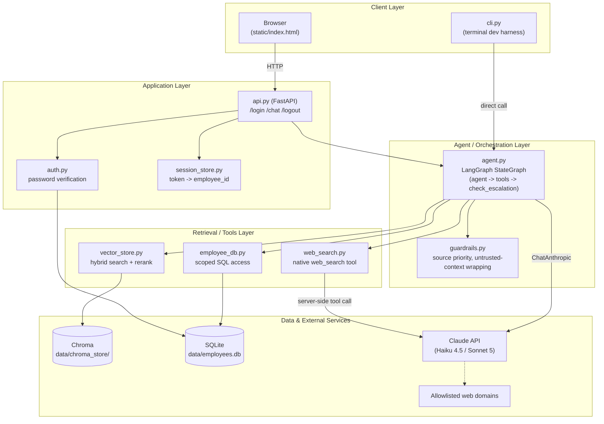
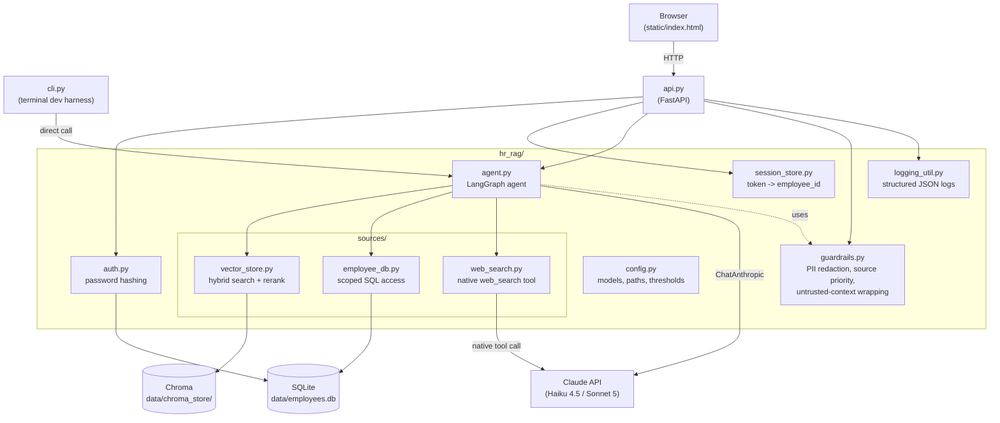
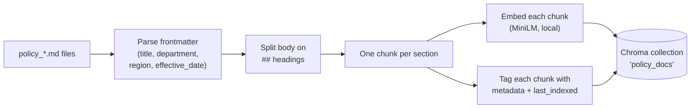
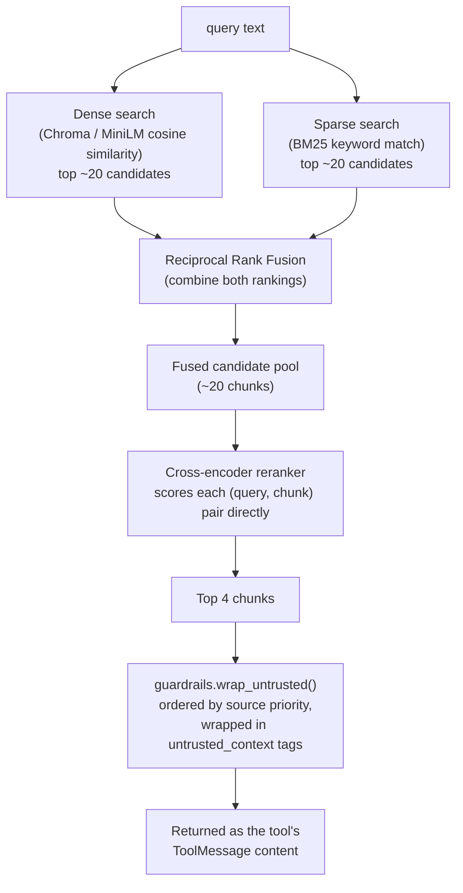
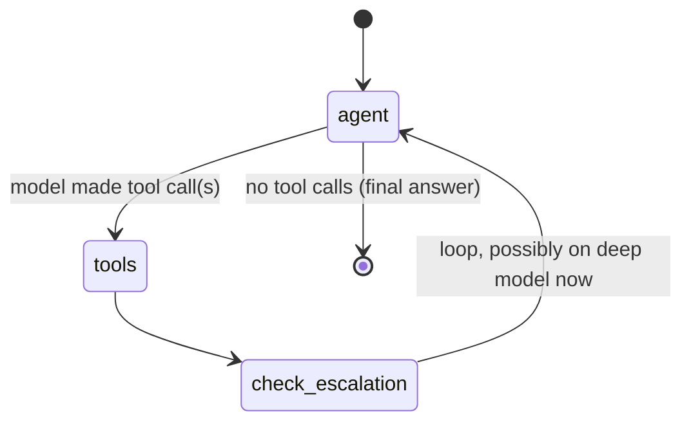
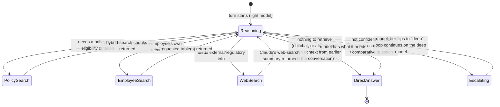
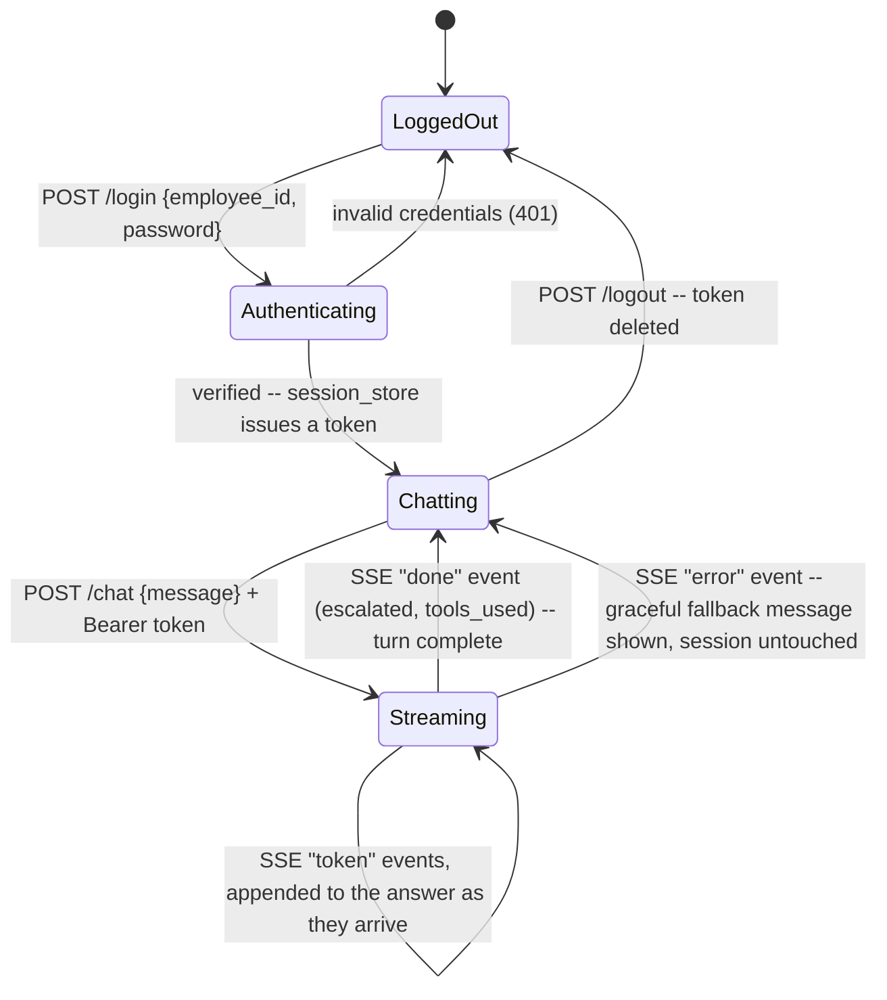
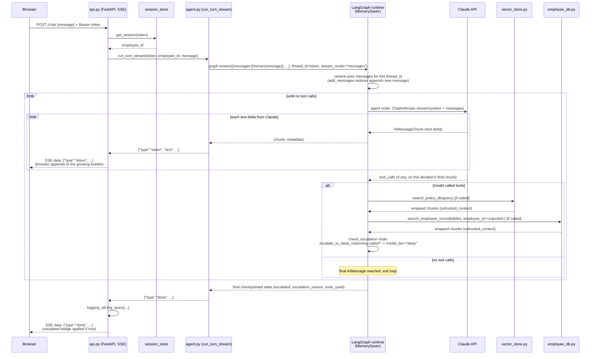

# Technical Overview

How this system is built, what each part does, and exactly what happens
— step by step, transformation by transformation — from a user typing a
question to an answer coming back.

## 1. Tech stack

| Layer | Technology | Why |
|---|---|---|
| LLM | Claude Haiku 4.5 (light) / Claude Sonnet 5 (deep) via Anthropic API | Two-tier cost/quality tradeoff — light model handles most turns, deep model only when the light model decides it needs to |
| Agent orchestration | **LangGraph** (`langgraph`, `langchain-anthropic`) | The model calls tools itself and decides when to escalate, instead of fixed code-driven routing |
| Conversation memory | LangGraph `MemorySaver` checkpointer | In-memory, keyed by session token as `thread_id` — gives multi-turn memory with no hand-written message-list management |
| Policy document store | **Chroma** (`chromadb`), embedded/local, `PersistentClient` | Vector DB for policy docs, no external service |
| Embeddings | `all-MiniLM-L6-v2` (Chroma's default, ONNX, local) | Dense semantic search, no API cost |
| Keyword search | **BM25** (`rank_bm25`) | Sparse retrieval for exact terms embeddings can miss (policy IDs, exact figures) |
| Reranking | Cross-encoder `cross-encoder/ms-marco-MiniLM-L-6-v2` (`sentence-transformers`) | Re-scores the fused candidate pool directly against the query, more precise than rank fusion alone |
| Employee records | **SQLite** (stdlib `sqlite3`) | 5 tables: `employees`, `employee_leaves`, `leave_requests`, `compensation`, `expense_reports` |
| Web search | Claude's native server-side `web_search_20260209` tool | No separate search API; domain-allowlisted at the tool level |
| Auth | stdlib `hashlib.pbkdf2_hmac` + `secrets` | Salted password hashing, no external auth service |
| Web API | **FastAPI** + **uvicorn** | `/login`, `/chat`, `/logout` + serves the static chat UI |
| Frontend | Plain HTML/CSS/vanilla JS (`static/index.html`) | No build step, no framework |
| Dev/test harness | `cli.py` | Terminal REPL hitting the same agent code as the web API |

## 2. Architecture diagram (layered view)



Five layers, each only talking to the one below it: the client never touches
a data store directly, and the agent layer is the only thing that talks to
Claude for reasoning (the web-search tool's call to Claude is a separate,
narrower path — it's Claude searching the web on the agent's behalf, not the
agent reasoning).

## 3. Module dependency map



## 4. What each part does

### `hr_rag/auth.py`
Salts + hashes a password with `pbkdf2_hmac("sha256", ..., 100_000 iterations)`. `verify_login()` re-hashes the submitted password with the stored salt and compares digests with `secrets.compare_digest` (constant-time). No plaintext password ever touches disk.

### `hr_rag/session_store.py`
An in-memory `{token: AuthSession(employee_id, created_at)}` map. This is **only** the auth layer — it does not hold conversation history. The token doubles as the LangGraph `thread_id`, so one identifier ties "who is this" to "what have we talked about."

### `hr_rag/agent.py` — the core
A LangGraph `StateGraph` with 3 nodes (`agent`, `tools`, `check_escalation`), 4 tools bound to the model (`search_policy_db`, `search_employee_record`, `search_web`, `escalate_to_deep_reasoning`), and a `MemorySaver` checkpointer. Full detail in section 6.

**Security invariant**: `search_employee_record`'s schema has no `employee_id` field. Its value is injected from graph state via LangGraph's `InjectedState` mechanism — the model can never see or set it, so it structurally cannot be made to fetch another employee's data, even via a prompt-injected instruction hidden in a retrieved document.

### `hr_rag/sources/vector_store.py`
Owns the policy document vector store: chunking on ingest, hybrid search + reranking on query. Detail in section 5.

### `hr_rag/sources/employee_db.py`
Parameterized SQL only, `employee_id` always in the `WHERE` clause. `search(employee_id, tables)` always returns the core employee record, plus whichever of `employee_leaves`/`leave_requests`/`compensation`/`expense_reports` the model explicitly requested by name in `tables` — see `hr_rag/table_catalog.py`, the single source of truth for what those tables are and what the model is told about them. All four `employee_id` foreign-key columns are indexed (`data/seed_employees.py`), so every lookup is an indexed `SEARCH`, not a full-table `SCAN` — verified via `EXPLAIN QUERY PLAN`.

### `hr_rag/sources/web_search.py`
Calls the Claude API directly with the native `web_search_20260209` server tool (`allowed_domains` from config) and extracts the model's own synthesized summary text as the result — no separate search API, no client-side result parsing.

### `hr_rag/guardrails.py`
- `redact_pii()` — regex redaction (email/SSN-shaped/phone patterns) for log lines only.
- `SOURCE_PRIORITY` / `SOURCE_PRIORITY_INSTRUCTION` — `policy_db > employee_db > web_search` precedence when sources disagree; folded into the agent's system prompt.
- `wrap_untrusted()` — renders retrieved chunks as `<untrusted_context source="...">` blocks, ordered by source priority, so the model treats retrieved text as data, never as instructions.

### `api.py`
FastAPI app: `POST /login` (issues a token), `POST /chat` (runs one agent turn), `POST /logout` (deletes the token). Serves `static/index.html` at `/`.

### `static/index.html`
Single page, vanilla JS: a login form that stores the token in a JS variable (not `localStorage`, since this is demo auth), then a chat UI that POSTs to `/chat` and renders the running conversation with an "escalated" badge on turns that used the deep model.

### `cli.py`
Same `agent.run_turn()` as the web app, no HTTP layer, skips real login (just picks an employee id) — fast way to test agent behavior from a terminal.

## 5. Policy document pipeline: ingest and query-time transformations

### Ingest (`python -m hr_rag.ingest data/policies/`, manual trigger)



Every ingest run **wipes and rebuilds** the whole collection from whatever `.md` files are currently in the directory — full re-index, not incremental.

### Query time (`vector_store.search(query)`, called by the `search_policy_db` tool)



## 6. The agent graph (`hr_rag/agent.py`)



- **`agent` node**: invokes `ChatAnthropic` (light or deep model, per `state["model_tier"]`) with the system prompt + full message history, bound to all 4 tools.
- **`tools` node**: LangGraph's `ToolNode` executes whichever tools the model called — **in parallel** if the model called more than one at once.
- **`check_escalation` node**: inspects the preceding `AIMessage` for a call to `escalate_to_deep_reasoning`; if found, flips `state["model_tier"]` to `"deep"` for the rest of this turn.
- Loop repeats until the model responds with no tool calls, or `MAX_ITERATIONS` (recursion cap) is hit.
- `agent.run_turn_stream()` drives this exact graph via `graph.stream(..., stream_mode="messages")`, yielding each text token the `agent` node produces (across every loop iteration) as it's generated, then one final event with `escalated`/`escalation_reason`/`tools_used` once the graph reaches `[*]`. `run_turn()` (still used by tests and anywhere a single blocking result is more convenient) is a thin wrapper that just concatenates the streamed tokens.

## 7. The agent framework: LangGraph, and exactly what it's doing for us

The agent is built on **LangGraph** (`langgraph`) + **`langchain-anthropic`**, not a hand-rolled tool-call loop and not the raw Anthropic SDK's beta Tool Runner. This was a deliberate choice, made explicitly (not a default) when the system moved from v1's fixed pipeline to an agent: LangGraph is more machinery than a single-branch, four-tool graph strictly needs, but it was chosen anticipating the graph growing (more branches, possibly multiple cooperating agents later), and because its checkpointer turned out to be an exact fit for "give this thing multi-turn memory."

Every LangGraph/LangChain feature actually in use, and why:

| Feature | Where | What it buys us |
|---|---|---|
| `StateGraph` + a typed `AgentState` (`TypedDict`) | `agent.py`, top of the file | Declares the shape of everything that flows through the graph (`messages`, `employee_id`, `model_tier`, `escalated`, `escalation_reason`) so every node reads/writes a known schema instead of an untyped dict |
| `Annotated[list, add_messages]` reducer | `AgentState.messages` | LangGraph's built-in message reducer — new messages **append** to existing history instead of overwriting it. This single line is what makes multi-turn memory work at all |
| `MemorySaver` checkpointer | `_build_graph()`, `graph.compile(checkpointer=...)` | Persists graph state (mainly `messages`) in-process, keyed by `thread_id`. This is the entire multi-turn memory mechanism — no hand-written session/message-list management anywhere in `agent.py` |
| `thread_id` (session token doubles as this) | `run_turn_stream()`'s `config={"configurable": {"thread_id": token}}` | Ties one browser login session to one persistent conversation in the checkpointer. Same token = same conversation resumed; a new token = a fresh thread with no memory of any other session |
| `graph.get_state(config)` | `run_turn_stream()`, both to find `prior_len` before a turn and to read final `escalated`/`tools_used` after | Reads the checkpointer directly — lets us diff "what's new this turn" against "what was already there" without the graph handing back that distinction itself |
| Prebuilt `ToolNode` | `_build_graph()`, the `tools` node | Executes whatever tools the model's `AIMessage.tool_calls` named — **concurrently** if it called more than one — and appends the resulting `ToolMessage`s. This is also why `vector_store._get_collection()` needed a thread-safety fix (§ elsewhere) — `ToolNode` genuinely runs calls in parallel threads, not just conceptually |
| `InjectedState` | `search_employee_record`'s `employee_id` parameter | Lets a tool read a value out of graph state at execution time without that value ever appearing in the tool's model-visible schema. This is the mechanism the whole employee-scoping security invariant is built on — not a convention, an actual LangGraph primitive |
| Conditional edges (`add_conditional_edges`) | `agent -> tools` vs `agent -> END` | The routing decision ("did the model just call a tool, or is this the final answer?") lives here as a plain Python function (`route_after_agent`) inspecting `AIMessage.tool_calls` — no LLM call needed to make that decision, it's mechanical |
| `stream_mode="messages"` | `run_turn_stream()` | Streams individual `(AIMessageChunk, metadata)` tuples as the model generates them, including a `langgraph_node` field used to filter to only the `agent` node's output (tool-internal chunks stay invisible to the user) |
| `recursion_limit` | `run_turn_stream()`'s `config`, set to `MAX_ITERATIONS` | LangGraph's built-in loop-iteration cap — guards against a runaway agent/tool-call cycle within one turn; raises `GraphRecursionError` (caught in `api.py`/`cli.py`) rather than looping forever |
| `ChatAnthropic` (`langchain-anthropic`) | `_make_model()` | The LangChain-native wrapper around the Anthropic Messages API — handles translating LangChain's `Tool`/message objects to and from Anthropic's wire format, so `agent.py` never constructs raw Anthropic API JSON by hand |
| `.bind_tools(_TOOLS)` | `_make_model()` | Attaches the tool schemas to a model instance once; every `.invoke()`/`.stream()` call on that bound model automatically includes them |
| `@tool` decorator (`langchain_core.tools`) | Every tool function in `agent.py` | Generates a tool's JSON schema from its Python type hints + docstring, so schemas stay in sync with the actual function signature instead of being hand-written and prone to drift |
| Message types (`HumanMessage`, `AIMessage`, `SystemMessage`, `ToolMessage`, `AIMessageChunk`) | Throughout `agent.py` | LangChain's typed message objects, not raw dicts — e.g. `isinstance(msg, AIMessage)` is how `tools_used` gets extracted, and `AIMessage.tool_calls` is a structured list rather than something parsed out of raw JSON |

**Deliberately not used**: the beta Anthropic Tool Runner (`client.beta.messages.tool_runner`) — this project has consistently avoided beta-dependent surfaces (the same reasoning that chose structured JSON output over the beta tool runner back in v1); and LangGraph's `create_react_agent` prebuilt — the hand-assembled `StateGraph` here is barely bigger than that prebuilt would be, and building it explicitly is what makes the `check_escalation` node (and the model-tier switch it drives) possible at all, which isn't something a generic ReAct-agent prebuilt exposes a hook for.

## 8. What kind of retrieval happens, and who decides

This is the part that replaced v1's fixed routing: there's no upfront classifier deciding "this needs policy_db." The model itself, inside the `agent` node above, decides per-turn (and can change its mind mid-turn) which of three retrieval types it needs, if any:



Each retrieval type, concretely:

| Retrieval | Tool | What decides *what* comes back |
|---|---|---|
| Policy | `search_policy_db(query)` | Hybrid search (dense + BM25 + rerank) over the whole ingested corpus — no table/doc selection, content similarity does the work |
| Employee record | `search_employee_record(tables)` | The model names 0+ tables from `TABLE_CATALOG` (`employee_leaves`, `leave_requests`, `compensation`, `expense_reports`); the core profile is always included regardless |
| Web | `search_web(query)` | Claude's own native `web_search_20260209` tool, restricted to `WEB_SEARCH_ALLOWED_DOMAINS` |
| None | — | Model answers directly (e.g. "hi") — no tool call at all |

`Reasoning` can call more than one retrieval type in the same pass (`ToolNode` runs them in parallel) before deciding whether it has enough — that's why "PTO balance and recent expenses" resolved in one turn with one `search_employee_record` call requesting two tables, rather than needing a full extra loop.

## 9. Request lifecycle: login through a streamed answer



Every `Chatting -> Streaming -> Chatting` cycle is one turn; the browser tab can sit in `Chatting` indefinitely between turns, and conversation memory (LangGraph's checkpoint for that token) persists across every cycle until the token itself is invalidated.

## 10. Session creation and management

There are actually **two separate session concepts** here, both keyed by the same bearer token but living in different places and owned by different code:

| | Auth session | Conversation session |
|---|---|---|
| Owns it | `hr_rag/session_store.py` | LangGraph's `MemorySaver` checkpointer (inside `hr_rag/agent.py`) |
| Key | the bearer token, as a dict key | the same token, passed as `thread_id` |
| Holds | `AuthSession(employee_id, created_at)` — just who's logged in | The full `messages` list (and `model_tier`/`escalated`/`escalation_reason`) for that conversation |
| Created | `session_store.create_session()`, called from `POST /login` | Implicitly, the first time `graph.invoke`/`graph.stream` runs with a `thread_id` LangGraph hasn't seen before — there's no separate "create conversation" call |
| Destroyed | `session_store.delete_session()`, called from `POST /logout` | **Not destroyed by `/logout`** — see below |

**Creation** (`POST /login`, `api.py`):
```python
if not auth.verify_login(body.employee_id, body.password):
    raise HTTPException(status_code=401, ...)
token = session_store.create_session(body.employee_id)
return LoginResponse(token=token)
```
`create_session()` generates the token via `secrets.token_urlsafe(32)` — a cryptographically random opaque string, not a JWT, so it carries no embedded claims and can't be decoded/inspected client-side; it's purely a lookup key. The auth session is created here; the conversation session doesn't exist yet — it comes into being lazily on the first `/chat` call for that token.

**Lookup, every authenticated request** (`_require_session()`, `api.py`): pulls the token off the `Authorization: Bearer <token>` header, looks it up in `session_store`, 401s if missing or unrecognized. This runs before every `/chat` and `/logout` call.

**Growth, every turn**: each `/chat` call passes the same token as `thread_id` into `agent.run_turn_stream()`. LangGraph's `add_messages` reducer appends the new turn's messages onto whatever's already checkpointed for that `thread_id` — this is the entire mechanism, there's no explicit "load history, append, save" code anywhere in this codebase to maintain.

**Destruction** (`POST /logout`, `api.py`):
```python
token, _ = _require_session(authorization)
session_store.delete_session(token)
```
This deletes the **auth session** only — the token immediately stops working for `/chat` (a 401 on the next lookup). The **conversation session** in LangGraph's checkpointer is not explicitly cleared; it just becomes unreachable, since nothing will ever present that token again as a valid, authenticated `thread_id`. In practice this is harmless (a logged-out token can never be used to resume that conversation, since auth is checked first, before the token ever reaches `agent.py`), but it does mean the checkpointer's memory for that thread isn't freed until the whole process restarts — a real, acknowledged limitation for a long-running deployment, not an oversight for this prototype's scope.

**Lifetime and persistence, both sessions**: pure in-memory Python dicts (`session_store._SESSIONS`, and `MemorySaver`'s internal store) — nothing touches disk. A server restart wipes every logged-in session and every conversation's memory at once. There's no session expiry/TTL implemented on either side — a token is valid indefinitely until an explicit `/logout` or a process restart, which is a reasonable simplification for a prototype but would need addressing (idle timeout, at minimum) before this ran as anything other than a demo.

## 11. End-to-end: one chat turn, start to finish (streaming)



Note the loop-within-a-loop: each pass through the tool-call loop can itself stream several text-delta chunks before the model either calls a tool or finishes — that's why partial "thinking out loud" text can appear even on a turn that ultimately calls a tool.

## 12. Data transformations, summarized

| Stage | Input | Transformation | Output |
|---|---|---|---|
| Policy ingest | `.md` file | Frontmatter parsed off, body split on `##`, each section embedded + BM25-indexed | Chroma chunks + metadata |
| Policy query | query string | Dense + sparse retrieval → RRF fusion → cross-encoder rerank → top 4 | `RetrievedChunk[]` → `wrap_untrusted()` text |
| Employee query | `(employee_id, tables: list[str])` | Core record always fetched (indexed `SEARCH` on `employees`' PK); each requested table name in `tables` that matches `TABLE_CATALOG` runs its own indexed, parameterized `SELECT ... WHERE employee_id = ?` | `RetrievedChunk[]` → `wrap_untrusted()` text |
| Web query | query string | Claude API call with native `web_search` tool, domain-allowlisted | Claude's synthesized text → `RetrievedChunk` → `wrap_untrusted()` text |
| Conversation | new `HumanMessage` | LangGraph's `add_messages` reducer appends to the checkpointed history for that `thread_id` | Full message list passed to the model each turn |
| Model response | stream of `AIMessageChunk`s (+ eventual `tool_calls`) | Each text-bearing chunk from the `agent` node is yielded immediately as a `{"type":"token"}` event; if the completed message carries tool calls, routed to `tools` node and the loop continues | Live token stream to the browser, plus (once done) `ToolMessage`s appended for the next loop iteration |
| Escalation | `escalate_to_deep_reasoning` tool call | `check_escalation` node flips `model_tier` in graph state | Next `agent` node invocation uses `DEEP_MODEL` instead of `LIGHT_MODEL` |
| Logging | query + turn result | `redact_pii()` on the query text, structured JSON assembled | One log line: timestamp, employee_id, query, tools used, escalated, latency |
