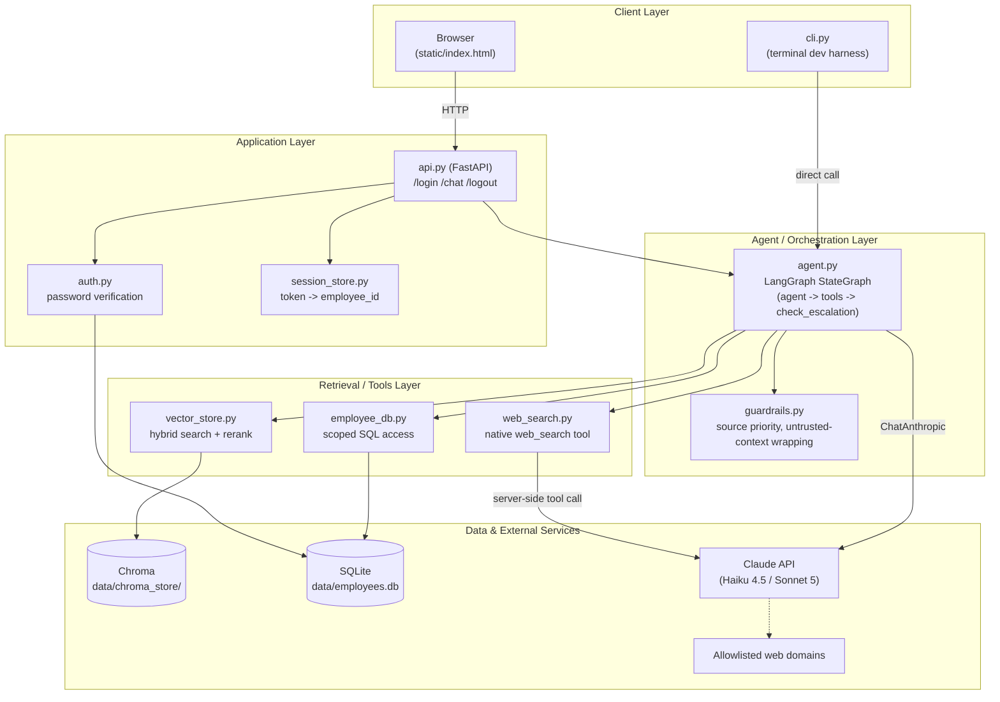
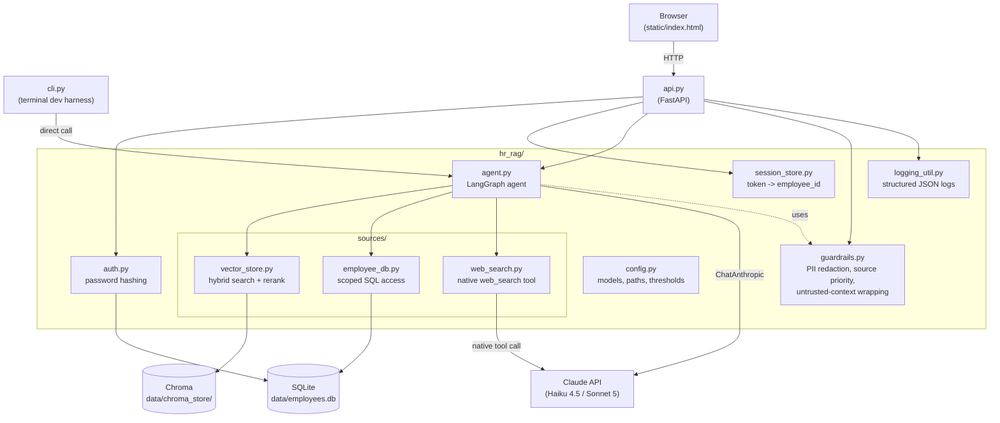
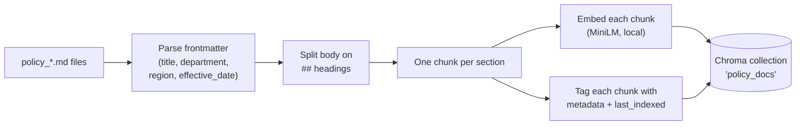
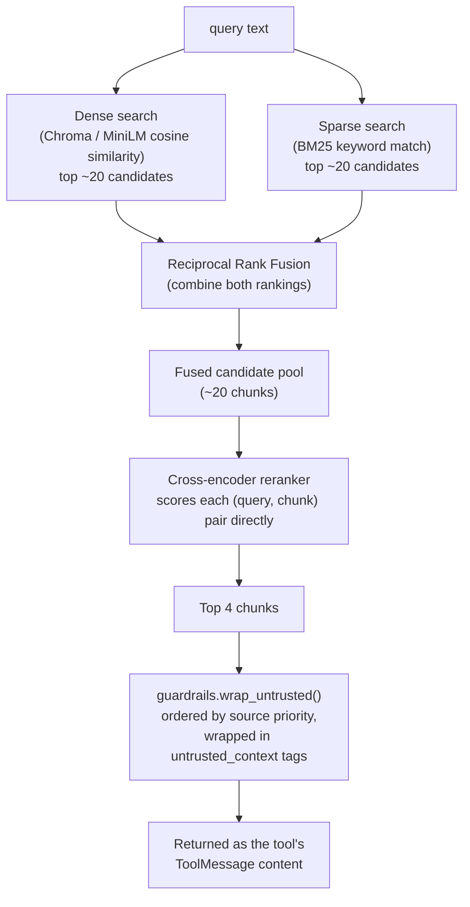
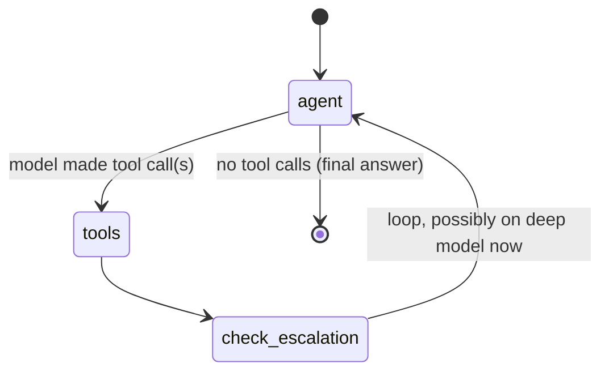
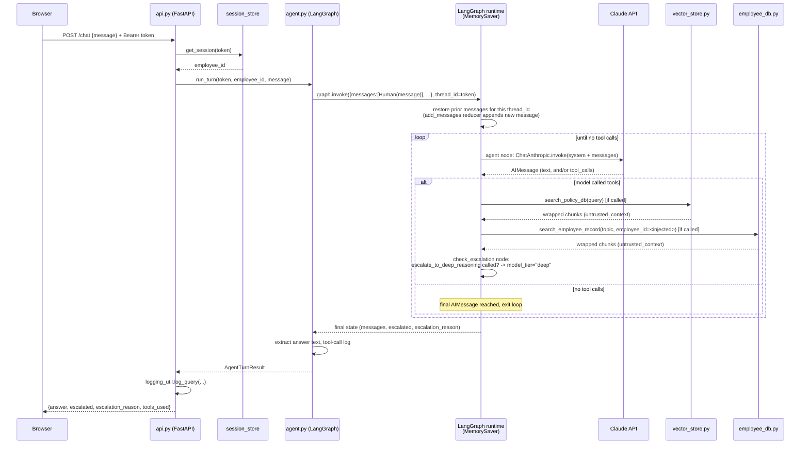

# Technical Overview

How this system is built, what each part does, and exactly what happens
— step by step, transformation by transformation — from a user typing a
question to an answer coming back.

## 1. Tech stack

| Layer | Technology | Why |
|---|---|---|
| LLM | Claude Haiku 4.5 (light) / Claude Sonnet 5 (deep) via Anthropic API | Two-tier cost/quality tradeoff — light model handles most turns, deep model only when the light model decides it needs to |
| Agent orchestration | **LangGraph** (`langgraph`, `langchain-anthropic`) | The model calls tools itself and decides when to escalate, instead of fixed code-driven routing |
| Conversation memory | LangGraph `MemorySaver` checkpointer | In-memory, keyed by session token as `thread_id` — gives multi-turn memory with no hand-written message-list management |
| Policy document store | **Chroma** (`chromadb`), embedded/local, `PersistentClient` | Vector DB for policy docs, no external service |
| Embeddings | `all-MiniLM-L6-v2` (Chroma's default, ONNX, local) | Dense semantic search, no API cost |
| Keyword search | **BM25** (`rank_bm25`) | Sparse retrieval for exact terms embeddings can miss (policy IDs, exact figures) |
| Reranking | Cross-encoder `cross-encoder/ms-marco-MiniLM-L-6-v2` (`sentence-transformers`) | Re-scores the fused candidate pool directly against the query, more precise than rank fusion alone |
| Employee records | **SQLite** (stdlib `sqlite3`) | 5 tables: `employees`, `employee_leaves`, `leave_requests`, `compensation`, `expense_reports` |
| Web search | Claude's native server-side `web_search_20260209` tool | No separate search API; domain-allowlisted at the tool level |
| Auth | stdlib `hashlib.pbkdf2_hmac` + `secrets` | Salted password hashing, no external auth service |
| Web API | **FastAPI** + **uvicorn** | `/login`, `/chat`, `/logout` + serves the static chat UI |
| Frontend | Plain HTML/CSS/vanilla JS (`static/index.html`) | No build step, no framework |
| Dev/test harness | `cli.py` | Terminal REPL hitting the same agent code as the web API |

## 2. Architecture diagram (layered view)

Five layers, each only talking to the one below it: the client never touches
a data store directly, and the agent layer is the only thing that talks to
Claude for reasoning (the web-search tool's call to Claude is a separate,
narrower path — it's Claude searching the web on the agent's behalf, not the
agent reasoning).

## 3. Module dependency map

## 4. What each part does

### `hr_rag/auth.py`
Salts + hashes a password with `pbkdf2_hmac("sha256", ..., 100_000 iterations)`. `verify_login()` re-hashes the submitted password with the stored salt and compares digests with `secrets.compare_digest` (constant-time). No plaintext password ever touches disk.

### `hr_rag/session_store.py`
An in-memory `{token: AuthSession(employee_id, created_at)}` map. This is **only** the auth layer — it does not hold conversation history. The token doubles as the LangGraph `thread_id`, so one identifier ties "who is this" to "what have we talked about."

### `hr_rag/agent.py` — the core
A LangGraph `StateGraph` with 3 nodes (`agent`, `tools`, `check_escalation`), 4 tools bound to the model (`search_policy_db`, `search_employee_record`, `search_web`, `escalate_to_deep_reasoning`), and a `MemorySaver` checkpointer. Full detail in section 6.

**Security invariant**: `search_employee_record`'s schema has no `employee_id` field. Its value is injected from graph state via LangGraph's `InjectedState` mechanism — the model can never see or set it, so it structurally cannot be made to fetch another employee's data, even via a prompt-injected instruction hidden in a retrieved document.

### `hr_rag/sources/vector_store.py`
Owns the policy document vector store: chunking on ingest, hybrid search + reranking on query. Detail in section 5.

### `hr_rag/sources/employee_db.py`
Parameterized SQL only, `employee_id` always in the `WHERE` clause. `search(employee_id, topic)` always returns the core employee record, plus keyword-gated chunks from `employee_leaves`/`leave_requests`/`compensation`/`expense_reports` depending on what `topic` mentions.

### `hr_rag/sources/web_search.py`
Calls the Claude API directly with the native `web_search_20260209` server tool (`allowed_domains` from config) and extracts the model's own synthesized summary text as the result — no separate search API, no client-side result parsing.

### `hr_rag/guardrails.py`
- `redact_pii()` — regex redaction (email/SSN-shaped/phone patterns) for log lines only.
- `SOURCE_PRIORITY` / `SOURCE_PRIORITY_INSTRUCTION` — `policy_db > employee_db > web_search` precedence when sources disagree; folded into the agent's system prompt.
- `wrap_untrusted()` — renders retrieved chunks as `<untrusted_context source="...">` blocks, ordered by source priority, so the model treats retrieved text as data, never as instructions.

### `api.py`
FastAPI app: `POST /login` (issues a token), `POST /chat` (runs one agent turn), `POST /logout` (deletes the token). Serves `static/index.html` at `/`.

### `static/index.html`
Single page, vanilla JS: a login form that stores the token in a JS variable (not `localStorage`, since this is demo auth), then a chat UI that POSTs to `/chat` and renders the running conversation with an "escalated" badge on turns that used the deep model.

### `cli.py`
Same `agent.run_turn()` as the web app, no HTTP layer, skips real login (just picks an employee id) — fast way to test agent behavior from a terminal.

## 5. Policy document pipeline: ingest and query-time transformations

### Ingest (`python -m hr_rag.ingest data/policies/`, manual trigger)

Every ingest run **wipes and rebuilds** the whole collection from whatever `.md` files are currently in the directory — full re-index, not incremental.

### Query time (`vector_store.search(query)`, called by the `search_policy_db` tool)

## 6. The agent graph (`hr_rag/agent.py`)

- **`agent` node**: invokes `ChatAnthropic` (light or deep model, per `state["model_tier"]`) with the system prompt + full message history, bound to all 4 tools.
- **`tools` node**: LangGraph's `ToolNode` executes whichever tools the model called — **in parallel** if the model called more than one at once.
- **`check_escalation` node**: inspects the preceding `AIMessage` for a call to `escalate_to_deep_reasoning`; if found, flips `state["model_tier"]` to `"deep"` for the rest of this turn.
- Loop repeats until the model responds with no tool calls, or `MAX_ITERATIONS` (recursion cap) is hit.

## 7. End-to-end: one chat turn, start to finish

## 8. Data transformations, summarized

| Stage | Input | Transformation | Output |
|---|---|---|---|
| Policy ingest | `.md` file | Frontmatter parsed off, body split on `##`, each section embedded + BM25-indexed | Chroma chunks + metadata |
| Policy query | query string | Dense + sparse retrieval → RRF fusion → cross-encoder rerank → top 4 | `RetrievedChunk[]` → `wrap_untrusted()` text |
| Employee query | `(employee_id, topic)` | Parameterized SQL against 5 tables, keyword-gated by `topic` | `RetrievedChunk[]` → `wrap_untrusted()` text |
| Web query | query string | Claude API call with native `web_search` tool, domain-allowlisted | Claude's synthesized text → `RetrievedChunk` → `wrap_untrusted()` text |
| Conversation | new `HumanMessage` | LangGraph's `add_messages` reducer appends to the checkpointed history for that `thread_id` | Full message list passed to the model each turn |
| Model response | `AIMessage` (+ optional `tool_calls`) | If tool calls present: routed to `tools` node, results appended as `ToolMessage`s, loop continues. If not: loop ends | Final answer text extracted via `_extract_text()` |
| Escalation | `escalate_to_deep_reasoning` tool call | `check_escalation` node flips `model_tier` in graph state | Next `agent` node invocation uses `DEEP_MODEL` instead of `LIGHT_MODEL` |
| Logging | query + turn result | `redact_pii()` on the query text, structured JSON assembled | One log line: timestamp, employee_id, query, tools used, escalated, latency |
